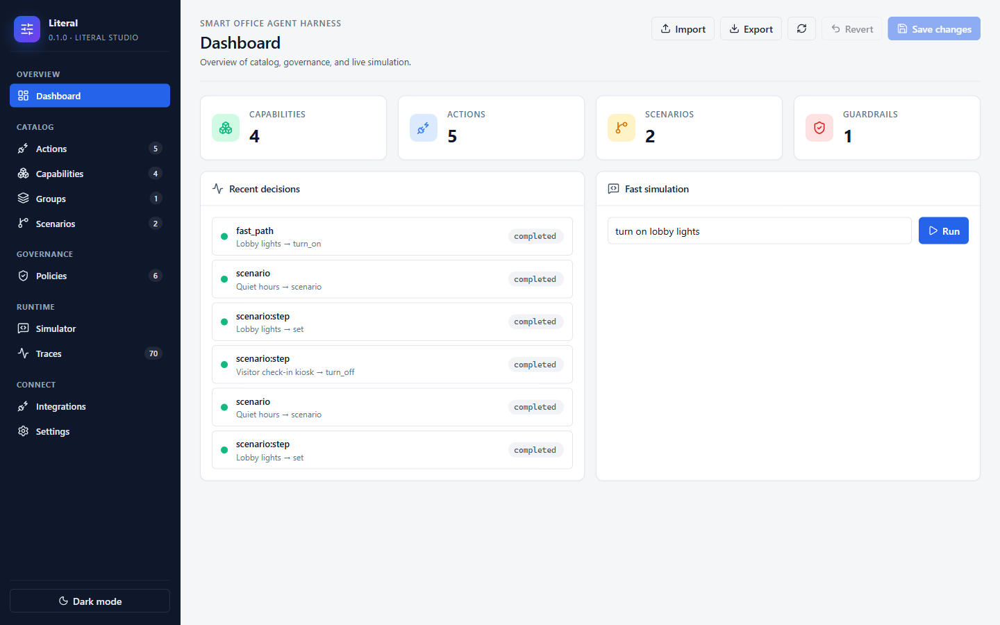
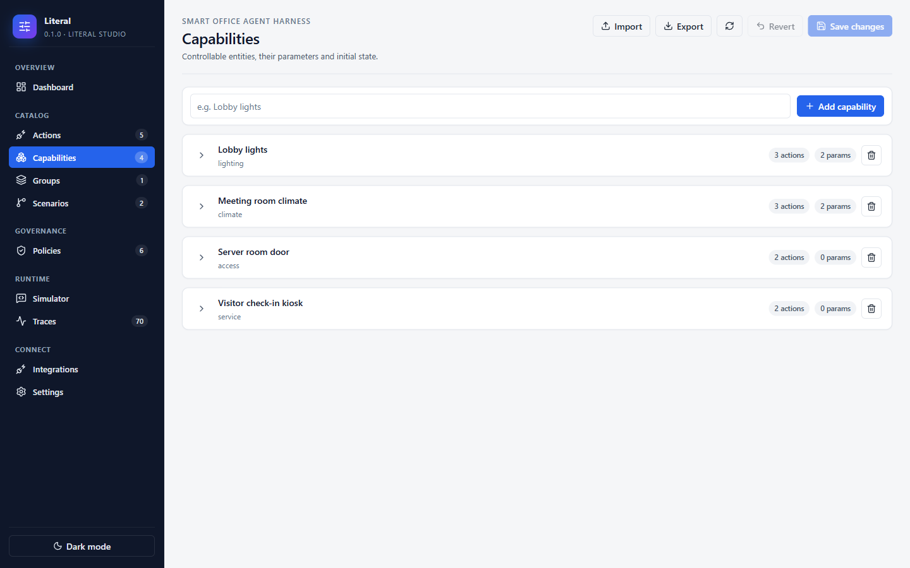
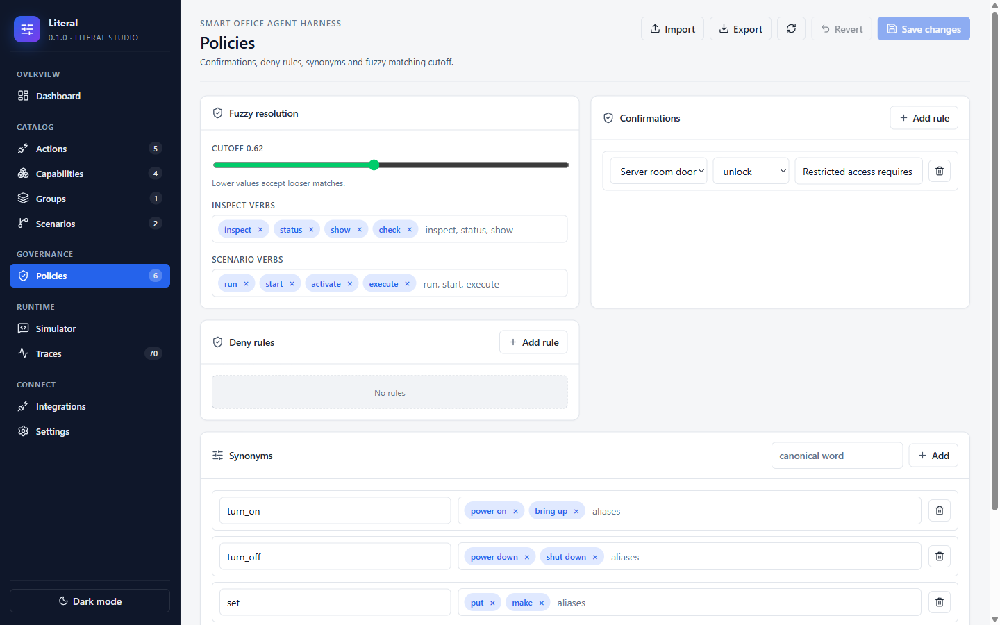
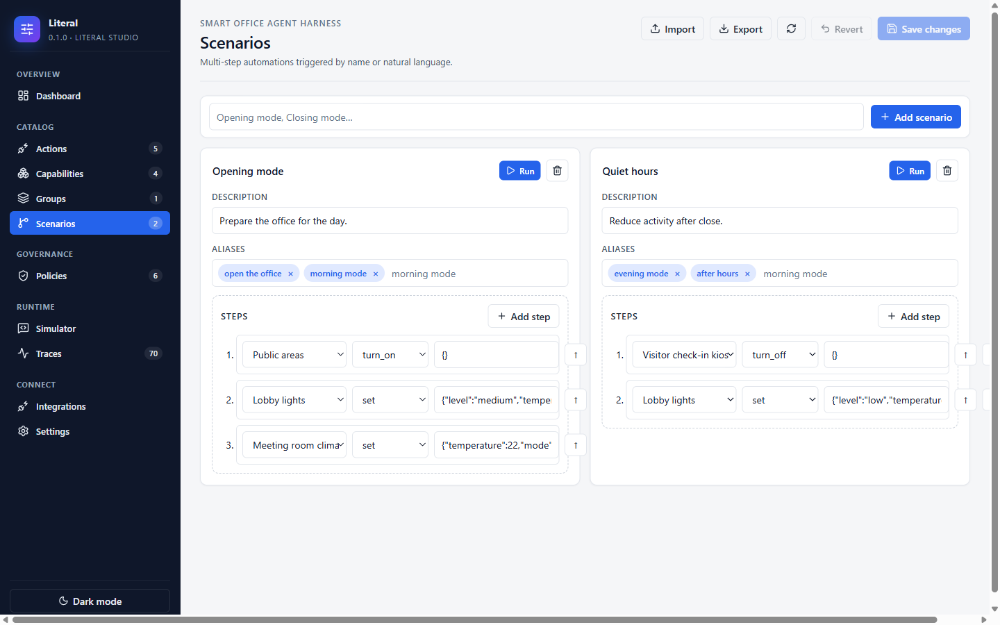
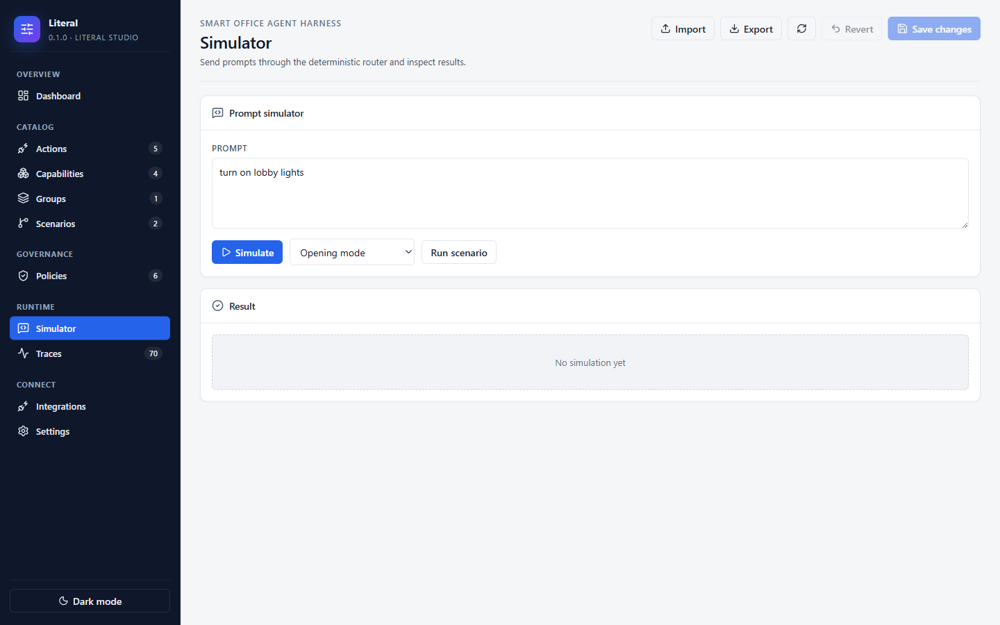
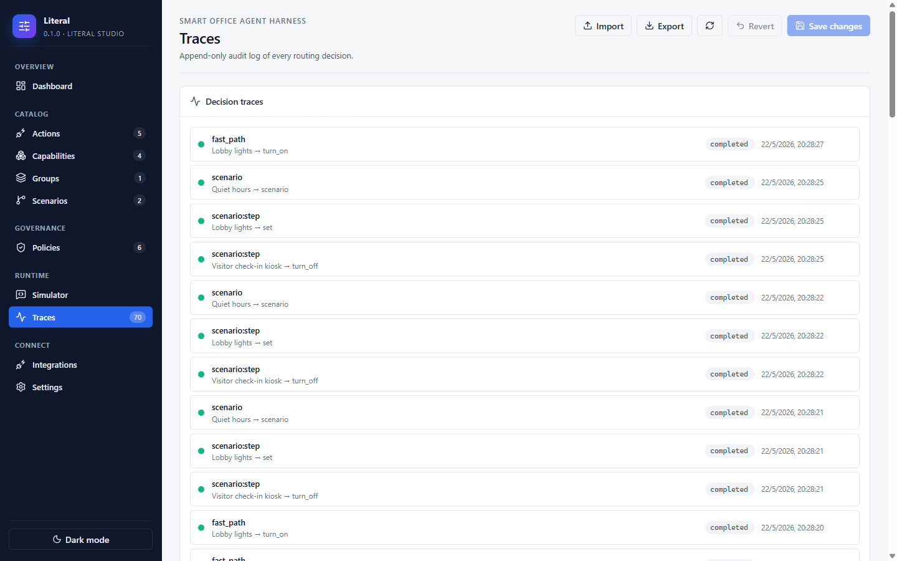
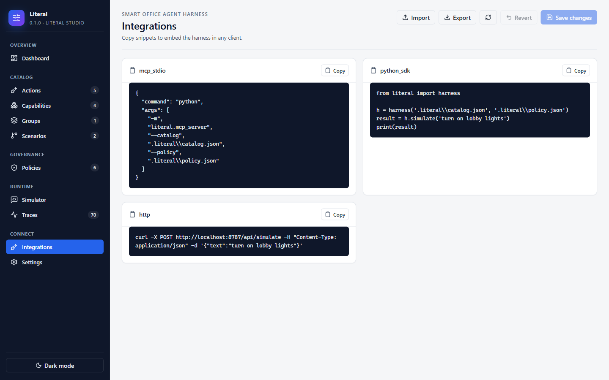
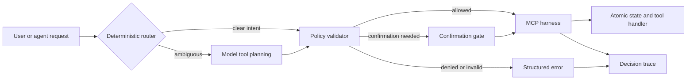

# Literal

**Deterministic MCP Harness Protocol.** Predictable tool decision and execution, compacted schema prompts, auditability, observility, normalization, generalization, local and private by design.

Literal sits between an agent and customer tools, turning ambiguous natural language into canonical calls where possible, validating every generated call before execution, and recording why a decision was allowed, denied, corrected, or escalated.

> License note: this repository is source-available for evaluation. Commercial, production, hosted, embedded, resale, or customer-facing use requires prior written license. See [LICENSE](LICENSE) and [COMMERCIAL_LICENSE_REQUEST.md](COMMERCIAL_LICENSE_REQUEST.md).

---

## Literal Studio

A local control plane to configure, simulate, and observe your MCP harness.

### Dashboard



### Capability catalog



### Policies



### Scenarios



### Simulator



### Decision traces



### Integration snippets



---

## Documentation

A full documentation tree lives under [`docs/`](docs/README.md). Suggested learning path:

1. [Getting Started](docs/getting-started.md) — install, init, first call (5 minutes).
2. [Concepts](docs/concepts.md) — the five primitives and how they compose.
3. [Tutorial](docs/tutorial.md) — build a support-desk agent end-to-end.
4. [Use Cases](docs/use-cases.md) — playbooks for support, DevOps, finance, healthcare, IoT, multi-tenant SaaS.
5. [Advanced Examples](docs/advanced-examples.md) — hospital command center, fintech risk ops, and critical infrastructure grid fixtures.
6. [Architecture](docs/architecture.md) — why the design is shaped this way.

Reference material: [Catalog](docs/catalog-reference.md) · [Policy](docs/policy-reference.md) · [CLI](docs/cli-reference.md) · [Python SDK](docs/python-sdk.md) · [HTTP API](docs/http-api.md) · [MCP Integration](docs/mcp-integration.md) · [Studio Guide](docs/studio-guide.md) · [Security](docs/security.md) · [Protocol Spec](docs/SPEC.md). Runnable fixtures live in [examples/advanced](examples/advanced/README.md).

## Use Cases at a Glance

Literal is most useful where wrong tool calls are expensive — money, safety, data, or trust.

- **Support-desk agents** — pattern-checked ticket IDs, deny on `reply` until QA, confirmations on `escalate`.
- **DevOps / runbook executors** — deny destructive verbs in prod, confirmations on restarts, scenarios codify the safe sequence.
- **IoT and building automation** — confirmations on every physical actuator; aliases kept tight to prevent fuzzy mistakes.
- **Financial operations** — `max` ceilings on refund amounts, confirmations above thresholds, deny on cross-currency calls.
- **Healthcare assistants** — patient-ID `pattern` constraints, deny on prescribing until clinician sign-off.
- **Multi-tenant SaaS copilots** — one catalog/policy per tenant, isolated by configuration, not by branching code.
- **Regulated / audit-ready deployments** — append-only JSONL traces ship directly to SIEM; replay is deterministic.

Read [docs/use-cases.md](docs/use-cases.md) for the full set with snippets.

For maximal demonstrations, see [Advanced Examples](docs/advanced-examples.md): hospital command center, fintech risk operations, and critical infrastructure grid orchestration.

---

## Why This Exists

Modern agents are powerful because they can call tools. They are risky because they can call the wrong tool, choose the wrong parameter, carry huge schemas into every prompt, or produce decisions nobody can explain later.

Literal makes the tool layer explicit:

- simple commands are resolved before the model is called;
- model-generated calls use small free-text schemas instead of massive enum payloads;
- free text is validated against a catalog, policies, aliases, and value constraints;
- every route produces a decision trace;
- teams can ship a customer harness without rewriting their agent runtime.

## The Method



### Layer 1 — Pre-Model Router

Resolves high-confidence text such as `turn on lobby lights`, `status server room door`, or `run opening mode` without calling an LLM. Uses action verbs, scenario verbs, inspect verbs, aliases, and fuzzy target matching.

### Layer 2 — Post-Generation Validator

When an LLM does call tools, the harness still validates target, action, parameters, allowed values, numeric ranges, deny rules, and confirmation rules. Compact string parameters are resolved to canonical names.

### Layer 3 — Compact Prompt Builder

Emits a stable vocabulary block instead of injecting thousands of enum tokens into every request. Stable prompts are easier to cache, inspect, and version.

### Layer 4 — Atomic State And Traceability

Every execution updates local state atomically and writes decision traces. A trace records input, route, matches, scores, action, parameters, outcome, latency, errors, and confirmation requirements.

## Repository Layout

```text
literal/
├── literal/                     # Python core, CLI, HTTP API, optional MCP adapter
├── apps/studio/                 # React Literal Studio
├── examples/minimal/            # 20-line SDK example
├── examples/typescript-client/  # HTTP/MCP integration snippet
├── schemas/                     # Catalog and policy JSON Schema
├── docs/assets/images/          # Studio screenshots used by this README
├── LICENSE                      # Source-available commercial restriction
└── COMMERCIAL_LICENSE_REQUEST.md
```

## Quick Start

```bash
python -m pip install -e .
literal init
literal doctor
literal dev
```

Then open `http://127.0.0.1:8787`.

For frontend development:

```bash
cd apps/studio
npm install
npm run dev
```

Vite proxies `/api` to the local harness on `http://127.0.0.1:8787`.

## One-Minute Simulation

```python
from literal import harness

h = harness("literal.catalog.json", "literal.policy.json")

print(h.simulate("turn on lobby lights"))
print(h.simulate("status lobby lights"))
print(h.simulate("run opening mode"))
```

## Configuration Model

A customer harness is described by two small files.

### Catalog

```json
{
  "actions": {
    "turn_on": { "verbs": ["turn on", "enable"] }
  },
  "capabilities": {
    "Workspace lights": {
      "actions": ["turn_on"],
      "aliases": ["desk lights"],
      "parameters": {
        "level": { "values": ["low", "medium", "high"] }
      }
    }
  }
}
```

### Policy

```json
{
  "fuzzy_cutoff": 0.62,
  "confirmations": [
    { "target": "Server room door", "action": "unlock", "reason": "Restricted access." }
  ],
  "deny": []
}
```

## CLI

| Command | Purpose |
| --- | --- |
| `literal init` | Create `literal.catalog.json`, `literal.policy.json`, and `.literal/`. |
| `literal doctor` | Validate the catalog, policies, and references. |
| `literal dev` | Start the local API and built Literal Studio. |
| `literal add-tool "Name" --action turn_on` | Add a capability scaffold. |
| `literal export` | Print MCP, Python SDK, and HTTP integration snippets. |

## Python SDK Usage

The package exposes a short factory plus first-class classes.

```python
from literal import harness

h = harness("literal.catalog.json", "literal.policy.json")

result = h.simulate("turn on lobby lights")
print(result["route"], result["ok"])
```

Need lower-level access? Build the pieces explicitly:

```python
from literal import Harness, Registry

registry = Registry.from_paths("literal.catalog.json", "literal.policy.json")
h = Harness(registry)
```

## MCP Integrations

Literal speaks Model Context Protocol over stdio. Install the optional adapter once:

```bash
python -m pip install 'literal[mcp]'
```

The adapter exposes three tools and two resources:

- tools: `invoke(target, action, parameters_json)`, `inspect(target)`, `scenario(name)`
- resources: `literal://catalog`, `literal://traces`

The base launch command used by every integration below is:

```bash
python -m literal.mcp_server --catalog literal.catalog.json --policy literal.policy.json
```

### Anthropic `mcp` Python SDK (verified)

```python
import asyncio
from mcp import ClientSession, StdioServerParameters
from mcp.client.stdio import stdio_client

async def main():
    params = StdioServerParameters(
        command="python",
        args=["-m", "literal.mcp_server",
              "--catalog", "literal.catalog.json",
              "--policy", "literal.policy.json"],
    )
    async with stdio_client(params) as (read, write):
        async with ClientSession(read, write) as session:
            await session.initialize()
            tools = await session.list_tools()
            print([t.name for t in tools.tools])  # ['invoke', 'inspect', 'scenario']

            result = await session.call_tool(
                "invoke",
                {"target": "Lobby lights",
                 "action": "turn_on",
                 "parameters_json": "{}"},
            )
            print(result.content[0].text)

asyncio.run(main())
```

### Claude Desktop / Claude Code

Add Literal to `claude_desktop_config.json` (or the Claude Code equivalent):

```json
{
  "mcpServers": {
    "literal": {
      "command": "python",
      "args": [
        "-m", "literal.mcp_server",
        "--catalog", "literal.catalog.json",
        "--policy", "literal.policy.json"
      ]
    }
  }
}
```

### LangChain (`langchain-mcp-adapters`)

```bash
python -m pip install langchain-mcp-adapters langchain-openai langgraph
```

```python
import asyncio
from langchain_mcp_adapters.client import MultiServerMCPClient
from langgraph.prebuilt import create_react_agent
from langchain_openai import ChatOpenAI

async def main():
    client = MultiServerMCPClient({
        "literal": {
            "command": "python",
            "args": ["-m", "literal.mcp_server",
                     "--catalog", "literal.catalog.json",
                     "--policy", "literal.policy.json"],
            "transport": "stdio",
        }
    })
    tools = await client.get_tools()
    agent = create_react_agent(ChatOpenAI(model="gpt-4o-mini"), tools)
    result = await agent.ainvoke({"messages": [("user", "Turn on the lobby lights")]})
    print(result["messages"][-1].content)

asyncio.run(main())
```

### OpenAI Agents SDK

```bash
python -m pip install openai-agents
```

```python
import asyncio
from agents import Agent, Runner
from agents.mcp import MCPServerStdio

async def main():
    async with MCPServerStdio(params={
        "command": "python",
        "args": ["-m", "literal.mcp_server",
                 "--catalog", "literal.catalog.json",
                 "--policy", "literal.policy.json"],
    }) as literal_server:
        agent = Agent(
            name="Office Ops",
            instructions="Use Literal tools to control office capabilities.",
            mcp_servers=[literal_server],
        )
        result = await Runner.run(agent, "Turn on the lobby lights")
        print(result.final_output)

asyncio.run(main())
```

### Cursor / Continue / Cline / Windsurf / Zed

Most MCP-aware editors read the same `mcpServers` object. Drop this block into the editor's MCP settings file (e.g. `~/.cursor/mcp.json`, `~/.continue/config.json`, `cline_mcp_settings.json`, etc.):

```json
{
  "mcpServers": {
    "literal": {
      "command": "python",
      "args": [
        "-m", "literal.mcp_server",
        "--catalog", "literal.catalog.json",
        "--policy", "literal.policy.json"
      ]
    }
  }
}
```

## HTTP API

`literal dev` starts a local API suitable for UI integration and smoke tests.

| Method | Path | Purpose |
| --- | --- | --- |
| `GET` | `/api/health` | Harness status. |
| `GET` | `/api/catalog` | Catalog and public policies. |
| `PUT` | `/api/catalog` | Save catalog JSON. |
| `GET` | `/api/policies` | Current policy JSON. |
| `PUT` | `/api/policies` | Save policy JSON. |
| `POST` | `/api/simulate` | Route and execute a text prompt. |
| `POST` | `/api/invoke` | Validate and execute a direct call. |
| `POST` | `/api/scenario` | Execute a scenario. |
| `GET` | `/api/traces` | Recent decision traces. |
| `GET` | `/api/integration` | Generated snippets. |

```bash
curl -X POST http://127.0.0.1:8787/api/simulate \
  -H "Content-Type: application/json" \
  -d '{"text":"turn on lobby lights"}'
```

## Decision Trace Example

```json
{
  "route": "fast_path",
  "input_text": "turn on lobby lights",
  "target": "Lobby lights",
  "action": "turn_on",
  "outcome": "completed",
  "matches": [
    { "field": "target", "requested": "lobby lights", "resolved": "Lobby lights", "score": 1.0, "method": "exact" }
  ]
}
```

## Security And Deployment Notes

Literal is local-first by default. It does not require telemetry, external storage, hosted inference, or a vendor control plane.

Production customers should still add:

- authentication and network boundaries for the HTTP API;
- secret management outside catalog files;
- policy review and approval workflows;
- signed releases and dependency license reports;
- environment-specific state and trace retention;
- observability exports if required by their platform.

## Commercial License

This repository is not open source. It is source-available for evaluation.

Commercial use includes, but is not limited to: production deployments; customer-facing use; hosted or managed services; inclusion in paid products; consulting delivery to third parties; redistribution or sublicensing; embedding in a commercial platform.

Request authorization using [COMMERCIAL_LICENSE_REQUEST.md](COMMERCIAL_LICENSE_REQUEST.md).

## Development

```bash
python -m pip install -e ".[dev]"
python -m pytest tests -q

cd apps/studio
npm install
npm run build
```
