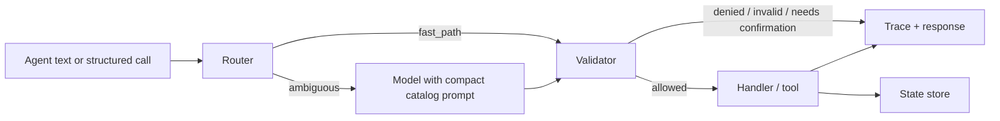

# Architecture

This document explains the *why* behind Literal's design choices. If you want the *what*, read [Concepts](concepts.md) and the reference docs.

## Design principles

1. **Determinism first.** Whenever a decision can be made without a language model, it must be. Models are used as a fallback, not as the path of least resistance.
2. **Two-phase trust.** Anything the model produces is treated as untrusted input. The validator is the only path to execution.
3. **Configuration over code.** Catalogs and policies are JSON. New domains, new guardrails, and new tenants ship without code changes.
4. **Local first.** No network call is required for the harness to run. State and traces live as files on disk so they are easy to back up, ship, and inspect.
5. **Auditable by default.** Every decision writes a JSONL record. There is no "fire and forget" path.
6. **Protocol over product.** The on-disk formats and the decision semantics are versioned independently of the Python implementation, so other languages can implement a compatible runtime — see [SPEC](SPEC.md).

## Pipeline

The pipeline is intentionally short. There are exactly four places a call can be rejected: router (no match), validator (denied, invalid, or unconfirmed), handler (raised), and state (conflict). Each writes a trace.

## Why a deterministic router

Most production agent traffic is repetitive. "Turn on lobby lights" appears thousands of times in slightly different phrasings; sending every one of them through a model is wasteful, slow, and unpredictable.

The router uses three cheap mechanisms before falling back to the model:

1. **Verb match.** Exact or near-exact matches to declared verbs.
2. **Inspect / scenario verbs.** Dedicated vocabularies that route to read-only or macro actions.
3. **Fuzzy match.** Cosine-like similarity over capability names and aliases, gated by `fuzzy_cutoff`.

Only if all three fail does the harness invoke the LLM with a compact prompt.

## Why post-generation validation

Tool schemas, function-calling APIs, and structured output all reduce the chance that a model emits nonsense — but none of them prevent *policy* violations. The model has no way to know that `Server room door.unlock` is forbidden in your environment.

The validator therefore enforces:

- the call is in the catalog;
- the parameters satisfy schema constraints;
- the action is not denied;
- a confirmation flag is present if required.

Validation runs identically whether the call came from the router, the model, the HTTP API, or the MCP adapter. There is one chokepoint.

## Why JSONL traces

JSONL is the boring choice and that is the point.

- It is append-only — concurrent writers are safe with a line-buffered approach.
- It is grep-friendly, jq-friendly, and ships directly to Splunk, Datadog, Elastic, and S3.
- It is human-readable.
- It is trivially replayable: given the same catalog and policy, re-running the inputs reproduces the outcomes.

A future release may add an optional binary format and signing; the JSONL contract will remain.

## Why local first

Most agent platforms today are managed services. That is fine for some teams and unacceptable for others (regulated industries, air-gapped networks, customer data residency). Literal runs entirely on the developer's machine or on a single VM:

- catalogs and policies are files;
- state and traces are files;
- the HTTP server binds to `127.0.0.1`;
- the MCP server speaks stdio.

Cloud deployments are a layering choice, not a prerequisite.

## Component map

| Component | Path | Role |
| --- | --- | --- |
| Registry | `literal/registry.py` | Parse and validate catalog + policy. |
| Router | `literal/router.py` | Verb + fuzzy resolution. |
| Validator | `literal/validator.py` | Deny / params / confirmations. |
| State store | `literal/state.py` | Per-capability JSON state, atomic writes. |
| Trace store | `literal/trace.py` | Append-only JSONL log. |
| Harness | `literal/harness.py` | Orchestrator. |
| HTTP server | `literal/server.py` | Local `/api/*` server. |
| MCP server | `literal/mcp_server.py` | stdio MCP adapter. |
| CLI | `literal/cli.py` | `literal` command. |
| Studio | `apps/studio/` | React UI. |

## Extending

- **New parameter constraint.** Add to the validator and document in [Catalog Reference](catalog-reference.md).
- **New policy rule.** Add to the validator's decision pipeline; surface in Studio's Policies tab.
- **New client.** Wrap the HTTP API or the MCP adapter — the harness has no concept of clients.
- **Other languages.** Implement the protocol described in [SPEC](SPEC.md). A conformance test suite is on the roadmap.

## Non-goals (today)

- Distributed multi-node state — use one process per tenant or front it with a stateful store of your choice.
- Built-in authentication on the HTTP API — front with a reverse proxy.
- Built-in PII redaction in traces — apply at the trace sink.
- Streaming tool calls — handlers are synchronous; long-running work belongs in a job queue.

These are deliberate omissions to keep the core protocol small.
