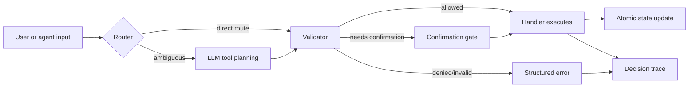

# Core Concepts

Literal turns "the agent decides which tool to call" into an inspectable, deterministic decision pipeline. To use it well, you need to understand five primitives.

## 1. The Catalog

The **catalog** is the truth of *what tools exist and what they accept*. It declares:

- **Actions** — verbs like `turn_on`, `unlock`, `set` with synonyms in natural language (`"turn on"`, `"enable"`).
- **Capabilities** — the things actions can be applied to: `Lobby lights`, `Server room door`. Each capability lists allowed actions, aliases (`"desk lights"`), parameter schemas, and initial state.
- **Groups** — named sets of capabilities (`"Workspace lights"` = all lights in the workspace area). A single command can fan out to all members.
- **Scenarios** — named sequences of calls (`"opening mode"` = unlock front door + turn on lobby lights + start coffee machine).

The catalog is a JSON file. It is the only artifact your domain expert needs to read.

## 2. The Policy

The **policy** is the truth of *how decisions are made and what is forbidden*. It declares:

- `fuzzy_cutoff` — minimum similarity (0..1) for fuzzy target matching.
- `inspect_verbs` / `scenario_verbs` — verbs that route to read or scenario operations.
- `synonyms` — value-level synonyms (`"max"` → `"high"`).
- `confirmations` — pairs of `(target, action)` that require explicit confirmation before execution.
- `deny` — pairs of `(target, action)` that are always rejected.

The policy is the lever your security or compliance team owns.

## 3. The Router

The **deterministic router** receives a free-text string and tries to resolve it without calling any LLM. It checks:

1. exact action verbs in the catalog;
2. inspect verbs (e.g., "status of...") → routes to `inspect`;
3. scenario verbs (e.g., "run opening mode") → routes to `scenario`;
4. fuzzy match on capability names and aliases above the configured cutoff.

If it finds a confident match it returns a `DirectRoute` and the LLM is **never invoked**. If it cannot resolve, it returns `AmbiguousRoute` and the agent is expected to produce a structured call instead.

The result: most of your traffic short-circuits the model entirely — faster, cheaper, fully reproducible.

## 4. The Validator

When the LLM does produce a call, the **policy validator** runs *before* execution:

- Is `target` a known capability or group?
- Is `action` allowed on this target?
- Are all required parameters present?
- Are parameter values within `values`, `min`/`max`, `pattern`?
- Is this pair on the `deny` list? → reject
- Is this pair on the `confirmations` list? → mark `requires_confirmation` and refuse to execute until confirmed

A model can produce a wrong call. The validator guarantees a wrong call never *runs*.

## 5. The Trace

Every decision — successful, denied, ambiguous, or errored — produces a **decision trace** with:

- input text,
- route taken (`fast_path`, `invoke`, `scenario`, `denied`, `ambiguous`),
- resolution matches (which targets were considered, with scores and methods),
- parameters (requested vs. resolved),
- outcome (`completed`, `denied`, `invalid`, `requires_confirmation`, `error`),
- timing (milliseconds),
- error details when applicable.

Traces are written to JSONL by default. They are your audit trail, your debugging tool, and your dataset for evaluation.

## How the layers fit together

The mental model is: **deterministic by default, model-assisted on demand, validated always, recorded always**.

## Related reading

- [Catalog Reference](catalog-reference.md) — every field of the catalog file.
- [Policy Reference](policy-reference.md) — every field of the policy file.
- [Architecture](architecture.md) — design rationale for each layer.
